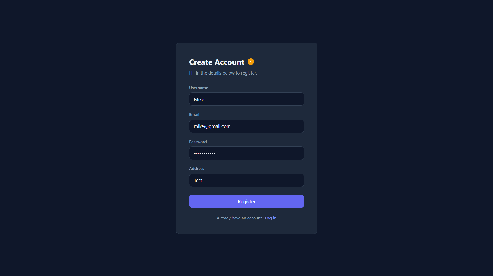
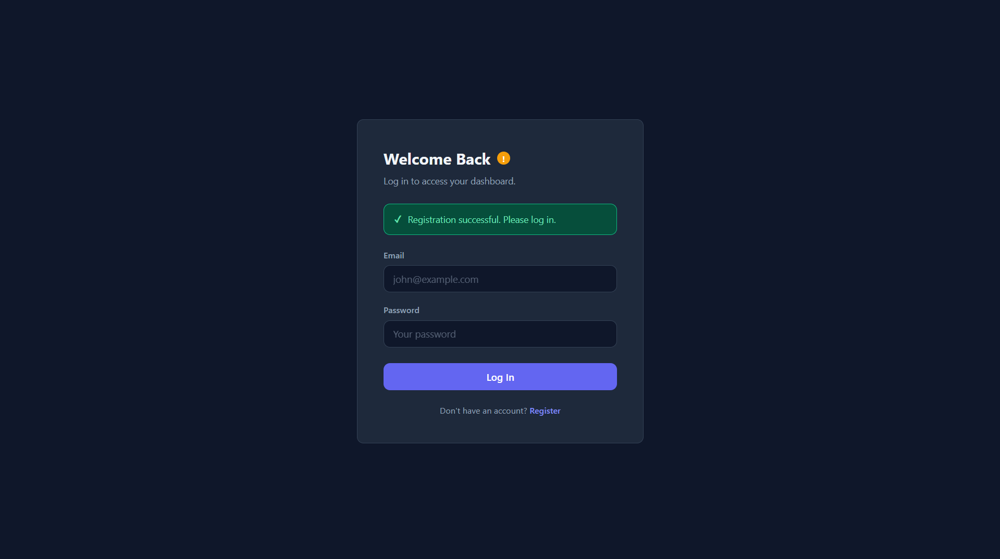
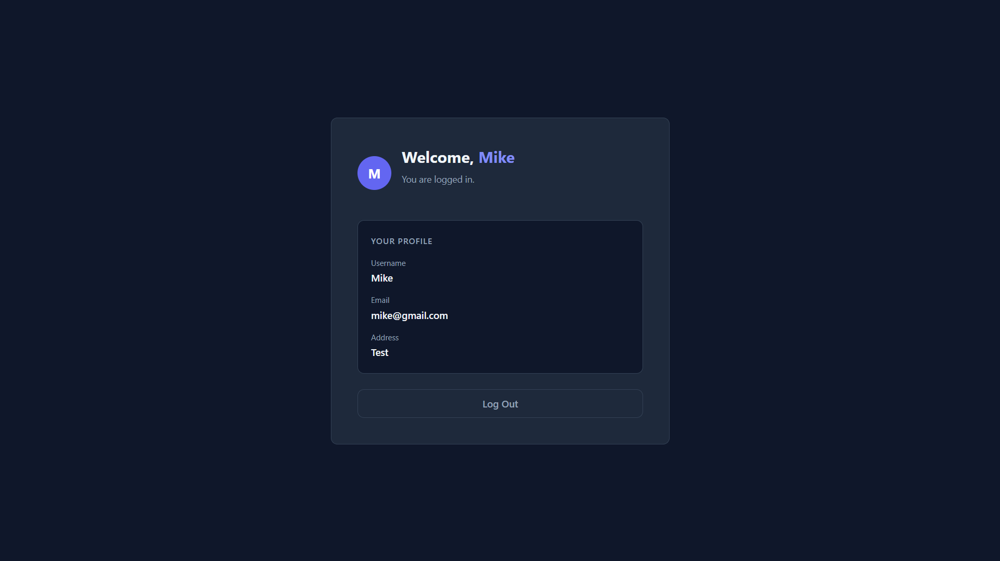

# CONTACT DETAILS
**DUZOKHO DOZO, 9366595479, duzokhodozo2@gmail.com**

# Stage 2 – React Frontend

This repository contains **Stage 2** of the assessment: a React frontend that connects to the [Stage 1 Backend API](https://github.com/SimpliMinimalist/Stage-1-Backend-API-with-Node.js).

It provides a working user interface for registration, login, and a protected dashboard — all powered by the Stage 1 API.

| Register | Login | Dashboard |
|----------|-------|-----------|
|  |  |  |


## Important

**Stage 1 must be running before you start Stage 2.**

The frontend makes HTTP requests to the backend at `http://localhost:3000`. If Stage 1 is not running, the UI will not be able to register, log in, or retrieve any data.

If you have not yet set up Stage 1, go here first: [Stage 1 Backend API](https://github.com/SimpliMinimalist/Stage-1-Backend-API-with-Node.js)

## Getting Started

> **Step 1:** Make sure the Stage 1 backend server is running (`npm run dev` in the Stage 1 directory). Keep that terminal open.

**Step 2:** In a new terminal window, clone this repository:

```bash
git clone https://github.com/SimpliMinimalist/Stage-2-React-Front-End.git
cd Stage-2-React-Front-End
```

**Step 3:** Install dependencies:

```bash
npm install
```

**Step 4:** Verify Environment Variables

> **Note:** A pre-configured `.env` file has been directly included in this repository to simplify the setup process. **In a real production environment, you should NEVER commit or push your `.env` file to source control.**

No changes are needed. The `.env` file is pre-configured to connect to `http://localhost:3000/api` — which is where the Stage 1 server runs by default.

**Step 5:** Start the development server:

```bash
npm run dev
```

**Step 6:** Open your browser and navigate to `http://localhost:5173`.

You should see the Register page. Create an account, log in, and you will be redirected to the dashboard displaying your username.

## Troubleshooting

> **"Failed to fetch" Error:** 
> If you attempt to log in or register and receive a "Failed to fetch" error in the UI, it means the Stage 1 backend API is either not running or is misconfigured. Ensure that you have a separate terminal window actively running `npm run dev` in the Stage 1 directory and that your MySQL database is properly connected.

## Technology Stack

- **Framework:** React 19
- **Build Tool:** Vite
- **Routing:** React Router v7
- **Styling:** Vanilla CSS
